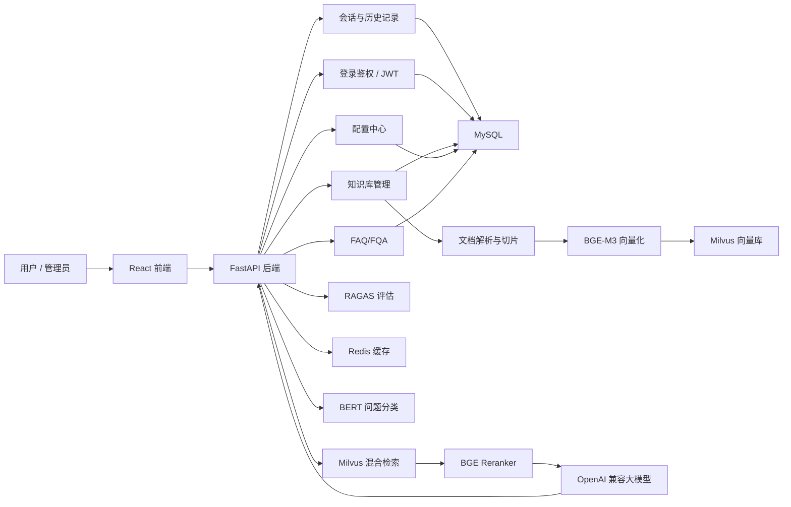

# RAG 教育问答系统

这是一个基于 `FastAPI + React + MySQL + Redis + Milvus + OpenAI 兼容大模型接口` 的 RAG 教育问答系统。项目包含完整的后端服务、前端管理界面、本地检索模型、知识库管理、FAQ/FQA 命中、流式问答、Case 分析、配置中心和 RAGAS 评估能力。

项目目标是让使用者克隆仓库后，安装依赖、补齐本地配置文件并启动基础服务，即可运行一个可管理知识库、可检索问答、可查看执行链路的完整 RAG 应用。

## 文档入口

- [部署指南](./DEPLOYMENT.md)：从克隆仓库到启动基础服务、后端和前端的完整步骤
- [后端说明](./integerate_qa_system/README.md)：后端接口、权限和模型配置说明
- [前端说明](./rag-frontend/README.md)：前端启动、页面和本地存储说明

## 核心能力

- 邮箱验证码登录、JWT 鉴权、管理员权限控制
- 普通问答模式：创建会话、流式回答、历史会话、重新生成回答
- RAG 检索链路：问题分类、策略选择、Milvus 混合检索、重排序、LLM 生成
- 知识库管理：分类、文件上传、文件预览、文档切片、切片查看、向量检索溯源
- FAQ/FQA 管理：快速问答维护、关键词检索、命中优先回答
- 配置中心：查看配置、编辑配置、版本保存、版本回滚、热加载
- Case 分析：根据用户反馈和执行链路分析回答质量
- 系统评估：上传评估集、运行 RAGAS 指标评估、查看评估结果
- 前端权限隔离：普通用户只看到问答模式，管理员可进入专业模式

## 技术栈

| 模块 | 技术 |
| --- | --- |
| 后端 API | FastAPI, Uvicorn, Pydantic |
| 前端 | React 19, Vite 7, Axios, React Markdown, React PDF |
| 关系数据库 | MySQL 8 |
| 缓存 | Redis 7 |
| 向量数据库 | Milvus 2.5 |
| 检索模型 | BGE-M3, BGE Reranker, BERT 分类模型 |
| 文档处理 | LangChain, PyMuPDF, python-docx, python-pptx, OCR 相关组件 |
| 大模型接口 | OpenAI-compatible API |
| 评估 | RAGAS, LangChain OpenAI/Ollama |
| 大文件管理 | Git LFS |

## 系统架构



## 目录结构

```text
RAG_program/
├── docker-compose.yml                  # MySQL / Redis / Milvus 基础服务
├── README.md                           # 项目总说明
├── integerate_qa_system/               # 后端服务
│   ├── api.py                          # FastAPI 入口
│   ├── api_routes/                     # 路由模块
│   ├── base/                           # 配置、日志、trace 模型
│   ├── login/                          # 登录与邮件验证码
│   ├── mysql_qa/                       # MySQL、Redis、BM25 相关逻辑
│   ├── rag_qa/                         # RAG 核心流程、模型、文档处理、评估
│   ├── config.example.ini              # 后端配置模板
│   ├── requirements.txt                # 后端依赖
│   └── README.md                       # 后端说明
├── rag-frontend/                       # 前端应用
│   ├── src/                            # 页面与组件
│   ├── package.json                    # 前端依赖和脚本
│   ├── .env.example                    # 前端环境变量模板
│   └── README.md                       # 前端说明
└── tools/                              # 辅助脚本
```

## 环境要求

- Git
- Git LFS
- Docker 和 Docker Compose
- Python 3.10 或更高版本
- Node.js 18 或更高版本
- npm
- 可用的 OpenAI 兼容大模型服务
- 可用 SMTP 邮箱服务，用于发送登录验证码

推荐先确认版本：

```bash
git --version
git lfs version
docker --version
python3 --version
node --version
npm --version
```

如果没有安装 Git LFS，需要先安装并初始化：

```bash
git lfs install
```

## 克隆项目

```bash
git clone https://github.com/zhangzgen/RAG_program.git
cd RAG_program
git lfs pull
```

模型权重通过 Git LFS 管理。如果克隆后模型目录里只看到很小的指针文件，通常是没有执行 `git lfs pull`。

## 模型文件说明

项目默认使用本地模型文件，主要位于：

```text
integerate_qa_system/rag_qa/models/bert-base-chinese
integerate_qa_system/rag_qa/models/bge-m3
integerate_qa_system/rag_qa/models/bge-reranker-large
integerate_qa_system/rag_qa/nlp_bert_document-segmentation_chinese-base
integerate_qa_system/rag_qa/core/bert_query_classifier
```

其中 `bge-m3` 和 `bge-reranker-large` 的大权重使用 HuggingFace 标准 safetensors 分片保存，避免超过 GitHub LFS 单文件大小限制。正常情况下不需要手动改代码，`from_pretrained` 会自动读取分片索引。

## 启动基础服务

仓库根目录提供了 `docker-compose.yml`，用于启动 MySQL、Redis、Milvus 及 Milvus 依赖的 etcd、MinIO。

```bash
docker compose up -d
```

默认端口：

| 服务 | 地址 |
| --- | --- |
| MySQL | `localhost:3306` |
| Redis | `localhost:6379` |
| Milvus | `localhost:19530` |
| MinIO API | `localhost:9000` |
| MinIO Console | `localhost:9001` |

查看服务状态：

```bash
docker compose ps
```

停止服务：

```bash
docker compose down
```

如需同时删除数据库和向量库数据卷：

```bash
docker compose down -v
```

## 后端配置

后端配置文件不提交到仓库。首次运行时复制模板：

```bash
cd integerate_qa_system
cp config.example.ini config.ini
```

然后编辑 `config.ini`。关键配置如下：

```ini
[mysql]
host = localhost
user = root
password = 123456
database = subjects_kg

[redis]
host = localhost
port = 6379
password = 1234
db = 0

[milvus]
host = localhost
port = 19530
database_name = itcast
collection_name = edurag_final

[llm]
model = qwen-plus
api_key = your_openai_compatible_api_key
base_url = https://dashscope.aliyuncs.com/compatible-mode/v1

[email]
qq_email = your_qq_email@qq.com
qq_auth_code = your_qq_email_auth_code

[jwt]
secret_key = change_this_to_a_random_secret
```

需要重点修改：

- `llm.api_key`：OpenAI 兼容接口的密钥
- `llm.base_url`：OpenAI 兼容接口地址
- `email.qq_email` 和 `email.qq_auth_code`：验证码发送邮箱配置
- `jwt.secret_key`：生产环境必须改成随机强密钥
- `mysql.password`、`redis.password`：如果修改了 `docker-compose.yml`，这里也要同步修改

不要把真实 `config.ini` 提交到仓库。

## 启动后端

建议使用虚拟环境：

```bash
cd integerate_qa_system
python3 -m venv .venv
source .venv/bin/activate
pip install -r requirements.txt
```

启动 API：

```bash
python api.py
```

或使用 Uvicorn：

```bash
uvicorn api:app --reload --host 0.0.0.0 --port 8000
```

默认访问地址：

- API: `http://localhost:8000`
- Swagger: `http://localhost:8000/docs`
- ReDoc: `http://localhost:8000/redoc`

后端启动时会自动初始化或补齐核心表结构，包括用户表、会话表、知识库表、配置版本表、评估表等。

## 启动前端

```bash
cd rag-frontend
cp .env.example .env
npm install
npm run dev
```

默认地址：

- 前端：`http://localhost:5173`
- 后端：`http://localhost:8000`

前端 `.env` 默认内容：

```env
VITE_API_BASE_URL=http://localhost:8000
```

常用脚本：

```bash
npm run dev
npm run build
npm run lint
npm run preview
```

## 首次使用流程

1. 启动 Docker 基础服务。
2. 配置并启动后端。
3. 配置并启动前端。
4. 在前端登录页输入邮箱，获取验证码并登录。
5. 新用户默认是普通用户，只能使用问答模式。
6. 如需进入专业模式，手动将用户设置为管理员。

授予管理员权限：

```sql
UPDATE user
SET is_admin = 1
WHERE email = 'admin@example.com';
```

管理员可以访问知识库、配置中心、FQA 管理、Case 分析和系统评估等专业模式页面。

## 知识库使用流程

1. 管理员登录后进入专业模式。
2. 在知识库页面创建或选择分类。
3. 上传 PDF、Word、PPT、TXT、Markdown 等资料。
4. 查看文件预览，确认内容可解析。
5. 执行文档切片。
6. 将切片写入 Milvus 向量库。
7. 在问答模式中基于知识库进行检索增强回答。

上传的业务数据、运行生成数据和输出文件不会提交到 GitHub，默认由 `.gitignore` 排除。

## RAG 问答链路

一次问题请求大致经过以下步骤：

1. 检查用户登录态和会话信息。
2. 尝试 FAQ/FQA 快速命中。
3. 使用 BERT 分类器判断问题类型。
4. 根据策略选择直接回答或检索增强回答。
5. 使用 BGE-M3 在 Milvus 中做混合检索。
6. 使用 BGE Reranker 对候选文档重排序。
7. 拼接上下文、历史消息和提示词。
8. 调用 OpenAI 兼容大模型生成答案。
9. 流式返回前端。
10. 将答案和执行链路 trace 写入 MySQL。

重新生成回答时，后端会读取原对话之前的历史上下文，并覆盖原 `conversation_id` 对应的答案和 trace 数据。

## 权限设计

系统使用 `user.is_admin` 区分普通用户和管理员：

- `0`：普通用户
- `1`：管理员

普通用户可访问：

- 登录和鉴权接口
- 问答接口
- 会话接口
- 重新生成接口

管理员额外可访问：

- `/knowledge/**`
- `/config/**`
- `/faq/**`
- `/cases/**`
- `/assessment/**`
- `PATCH /conversations/{conversation_id}/status`

权限边界以后端校验为准，前端只做交互层拦截。

## 常用接口

### 鉴权

| 方法 | 路径 | 说明 |
| --- | --- | --- |
| `POST` | `/send-verification-code` | 发送邮箱验证码 |
| `POST` | `/login` | 登录并返回 token |
| `GET` | `/verify-token` | 校验 token |

### 问答与会话

| 方法 | 路径 | 说明 |
| --- | --- | --- |
| `POST` | `/query` | 提交问题并以 SSE 方式流式返回 |
| `POST` | `/sessions/create` | 创建会话 |
| `GET` | `/sessions` | 获取会话列表 |
| `GET` | `/sessions/{session_id}` | 获取会话详情 |
| `DELETE` | `/sessions/{session_id}` | 删除会话 |
| `PATCH` | `/conversations/{conversation_id}/regenerate` | 重新生成回答 |
| `POST` | `/conversations/{conversation_id}/regenerate/stream` | 流式重新生成回答 |

### 管理员接口

| 路径 | 说明 |
| --- | --- |
| `/knowledge/**` | 知识库分类、文件、切片、检索 |
| `/config/**` | 配置查看、保存、回滚 |
| `/faq/**` | FQA 管理 |
| `/cases/**` | Case 分析 |
| `/assessment/**` | 系统评估 |

完整接口可查看 Swagger：`http://localhost:8000/docs`。

## 数据与版本控制策略

仓库包含：

- 后端代码
- 前端代码
- 配置模板
- Docker Compose
- 运行必需的模型结构文件和权重文件
- 前后端依赖声明文件

仓库不包含：

- `config.ini`
- `.env`
- 虚拟环境
- `node_modules`
- 构建产物 `dist`
- 日志
- 用户上传文件
- 评估上传文件
- 论文输出、截图输出和其他生成产物
- 训练 checkpoint 和缓存

大模型权重由 Git LFS 管理。提交模型相关变更前先确认：

```bash
git lfs ls-files
git status --short
```

## 开发检查

后端语法检查：

```bash
python3 -m compileall integerate_qa_system -q -x '(/venv/|/\.venv/|venv\.corrupt|__pycache__|/data/)'
```

前端构建：

```bash
cd rag-frontend
npm run build
```

前端代码检查：

```bash
cd rag-frontend
npm run lint
```

## 常见问题

### 克隆后模型加载失败

先确认是否拉取了 LFS 文件：

```bash
git lfs pull
git lfs ls-files
```

如果模型文件只有几 KB，说明当前是 LFS 指针文件，不是真实权重。

### 后端无法连接 MySQL、Redis 或 Milvus

检查 Docker 服务是否启动：

```bash
docker compose ps
```

再检查 `integerate_qa_system/config.ini` 中的连接信息是否与 `docker-compose.yml` 一致。

### 登录收不到验证码

检查：

- `email.qq_email`
- `email.qq_auth_code`
- SMTP 服务地址和端口
- 邮箱是否开启 SMTP 授权码

开发时也可以查看后端日志定位邮件发送异常。

### 普通用户看不到专业模式

这是预期行为。需要在数据库中把用户 `is_admin` 改为 `1`。

### 前端请求地址不对

检查 `rag-frontend/.env`：

```env
VITE_API_BASE_URL=http://localhost:8000
```

修改后重启 Vite 开发服务。

### GitHub 上传大模型失败

模型必须通过 Git LFS 管理。单个 LFS 文件也不能超过 GitHub 当前限制。超过限制的 HuggingFace 权重应使用 `save_pretrained(max_shard_size=...)` 分片保存。

## 生产部署建议

- 不要使用示例密码和示例 JWT 密钥。
- MySQL、Redis、Milvus 建议使用独立持久化存储。
- 后端建议使用进程管理器或容器部署。
- 前端使用 `npm run build` 后部署 `dist` 静态资源。
- 配置文件和密钥通过环境变量或安全配置中心管理。
- 对上传文件大小、文件类型、访问权限和日志脱敏做额外限制。

## 许可证

当前仓库未显式声明开源许可证。如需对外发布或团队协作，请先补充许可证文件并明确模型、数据和第三方依赖的使用范围。
